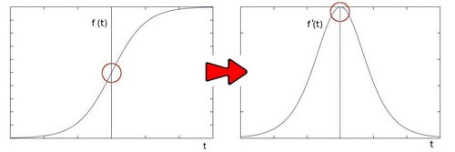
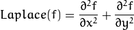

# Laplace

这次使用OpenCV函数 [Laplacian](http://opencv.willowgarage.com/documentation/cpp/image_filtering.html#cv-laplacian) 实现 *Laplacian 算子* 的离散模拟。 


# 原理

1. 前一节我们学习了 *Sobel 算子* ，其基础来自于一个事实，即在边缘部分，像素值出现”跳跃“或者较大的变化。如果在此边缘部分求取一阶导数，你会看到极值的出现。正如下图所示：

<div align=center>
   
</div>

2. 如果在边缘部分求二阶导数会出现什么情况?

<div align=center>
   
</div>

   你会发现在一阶导数的极值位置，二阶导数为0。所以我们也可以用这个特点来作为检测图像边缘的方法。 但是， 二阶导数的0值不仅仅出现在边缘(它们也可能出现在无意义的位置),但是我们可以过滤掉这些点。

## Laplacian 算子

1. 从以上分析中，我们推论二阶导数可以用来 *检测边缘* 。 因为图像是 “*2维*”, 我们需要在两个方向求导。使用Laplacian算子将会使求导过程变得简单。
2. *Laplacian 算子* 的定义:

<div align=center>
   
</div>

3. OpenCV函数 [Laplacian](http://opencv.willowgarage.com/documentation/cpp/image_filtering.html#cv-laplacian) 实现了Laplacian算子。 实际上，由于 Laplacian使用了图像梯度，它内部调用了 *Sobel* 算子。

# 代码解释

1. 首先申明变量:

   ```C++
   Mat src, src_gray, dst;
   int kernel_size = 3;
   int scale = 1;
   int delta = 0;
   int ddepth = CV_16S;
   char* window_name = "Laplace Demo";
   ```

2. 装载原图像:

   ```C++
   src = imread( argv[1] );
   
   if( !src.data )
     { return -1; }
   ```

3. 高斯平滑降噪:

   ```C++
   GaussianBlur( src, src, Size(3,3), 0, 0, BORDER_DEFAULT );
   ```

4. 使用 [cvtColor](http://opencv.willowgarage.com/documentation/cpp/imgproc_miscellaneous_image_transformations.html#cv-cvtcolor) 转换为灰度图

   ```C++
   cvtColor( src, src_gray, CV_RGB2GRAY );
   ```

5. 对灰度图使用Laplacian算子:

   ```C++
   Laplacian( src_gray, dst, ddepth, kernel_size, scale, delta, BORDER_DEFAULT );
   ```

   函数接受了以下参数:

   - *src_gray*: 输入图像。
   - *dst*: 输出图像
   - *ddepth*: 输出图像的深度。 因为输入图像的深度是 *CV_8U* ，这里我们必须定义 *ddepth* = *CV_16S* 以避免外溢。
   - *kernel_size*: 内部调用的 Sobel算子的内核大小，此例中设置为3。
   - *scale*, *delta* 和 *BORDER_DEFAULT*: 使用默认值。

6. 将输出图像的深度转化为 *CV_8U* :

   ```C++
   convertScaleAbs( dst, abs_dst );
   ```

7. 显示结果:

   ```C++
   imshow( window_name, abs_dst );
   ```

